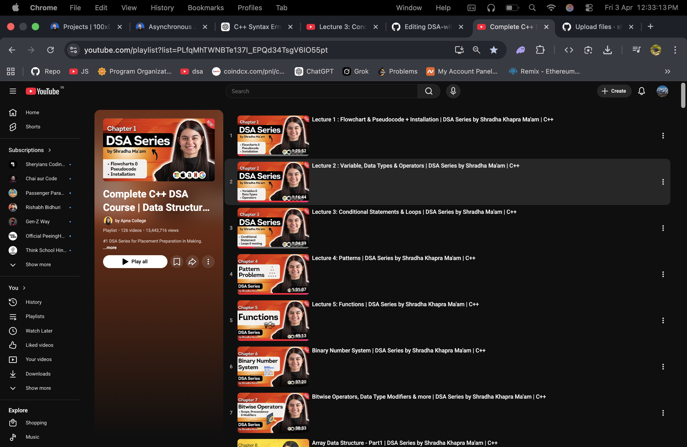

# DSA with C++
📌 DSA with C++ (Apna College)

🚀 About This Repository

This repository contains my Data Structures and Algorithms (DSA) learning journey using C++, following the playlist by Apna College.
I am solving problems, writing code, and improving my logic step by step.

📚 What You Will Find Here
Basics of C++

Arrays & Vectors

Sorting Algorithms

Recursion

Linked List

Stack & Queue

Trees & Graphs

Dynamic Programming

Problem-solving practice

🎥 Playlist Link

👉 Watch the full playlist here:
🔗 https://www.youtube.com/playlist?list=PLfqMhTWNBTe137I_EPQd34TsgV6IO55pt

